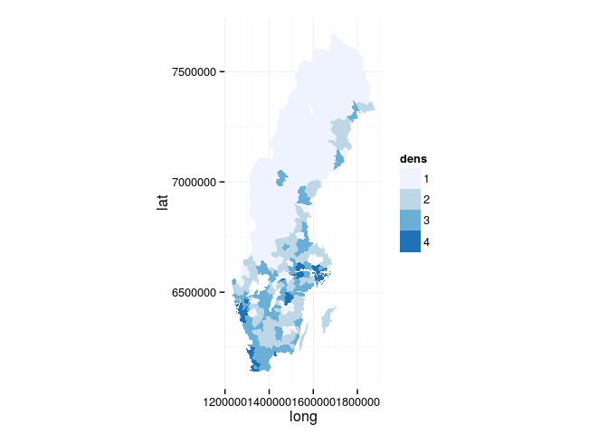

SweBoundaries
=============

R data for Swedish administrative boundaries of counties and municipalities from 1977-2008.

``` r
library(sweboundaries)
library(dplyr)
library(ggplot2)

m <- swe_boundaries(1996, "mun", "df")

data(geo_pop)

md <- geo_pop %>% filter(year == 1996) %>% 
  left_join(m, ., by = "knkod") %>% 
  mutate(
    dens = pop/(area/100),
    dens = cut(dens, quantile(dens), labels = c(1:4))
    )
knitr::kable(md %>% select(geomid:year) %>% distinct() %>% slice(1:10))
```

| geomid   |       area| knkod | knnamn         |  from|   tom|    pop|  year|
|:---------|----------:|:------|:---------------|-----:|-----:|------:|-----:|
| 01149999 |   90345207| 0114  | Upplands Väsby |  1977|  2006|  36277|  1996|
| 01369999 |  388838630| 0136  | Haninge        |  1977|  2006|  65706|  1996|
| 12569999 |  460238995| 1121  | Östra Göinge   |  1977|  1996|  15061|  1996|
| 12579999 |  343676138| 1137  | Örkelljunga    |  1977|  1996|   9650|  1996|
| 12609999 |  115369517| 1260  | Bjuv           |  1977|  2006|  14199|  1996|
| 12619999 |  166011795| 1261  | Kävlinge       |  1977|  2006|  24169|  1996|
| 12629999 |   56075589| 1262  | Lomma          |  1977|  2006|  17576|  1996|
| 12639999 |  221151506| 1263  | Svedala        |  1977|  2006|  17915|  1996|
| 12649999 |  205789842| 1264  | Skurup         |  1977|  2006|  13680|  1996|
| 12659999 |  514762507| 1265  | Sjöbo          |  1977|  2006|  16571|  1996|

``` r
ggplot(md, aes(long, lat, group = group, fill = dens)) +
  scale_fill_brewer() +
  geom_polygon() + coord_equal() + theme_minimal()
```



Credits
-------

Inspired by [USAboundaries](https://github.com/ropensci/USAboundaries)

Data from [SCB](http://www.gis.scb.se/how/PXmap1/index.asp)
